# 2017 TJCTF WriteUp

## 0x00 reverse
### 0x01 这是一道签到题(100)

这道题提供了一个apk文件，因此通过`jeb`反编译，可以看到`CheckFlag`函数：

```
boolean CheckFlag(byte[] arg8) {
    int v6 = 116;
    int v5 = 115;
    boolean v0 = true;
    int v4 = 121;
    if(arg8.length != 19 || arg8[0] != v6 || arg8[1] != 106 || arg8[2] != 123 || arg8[3] != 113 || arg8[4] != v5 || arg8[5] != v4 || arg8[6] != 100 || arg8[7] != v6 || arg8[8] != v4 || arg8[9] != v4 || arg8[10] != 95 || arg8[11] != 109 || arg8[12] != v4 || arg8[13] != 104 || arg8[14] != 99 || arg8[15] != v5 || arg8[16] != 108 || arg8[17] != 120 || arg8[18] != 125) {
        v0 = false;
    }
    return v0;
}
```
可以发现这个apk是做了一次字符串比较，而`arg8`很明显是flag，程序中看到的这些数值都是ascii码，转换后得到：`tj{qsydtyy_myhcslx}`

在apk模拟器里测一下，果不其然：

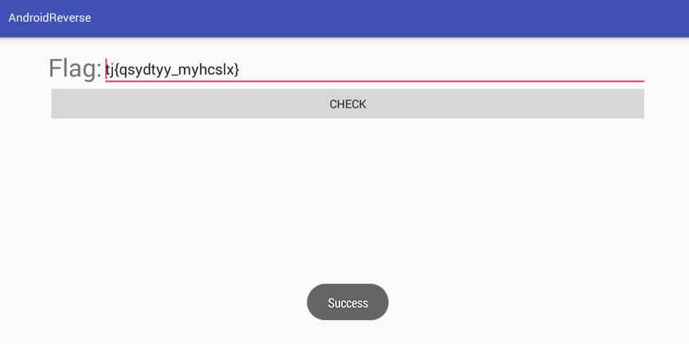

### 0x02 .NETTEN.(200)

题目提示了 **.Net架构** 和 **reflection**，那么想到了用于逆向.Net架构的软件`Reflector`。

反编译以后，先看`main`函数：

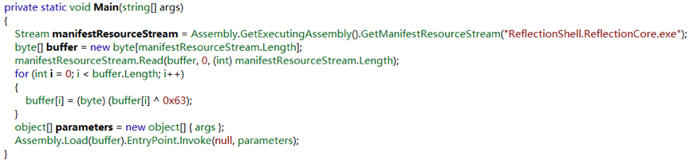

显然是把里面的`ReflectionCore`读入了`buffer`，经过异或处理以后运行。

那么剥出`ReflectionCore.exe`，并使用`Xor Assistant`进行`0x63异或处理`，然后再用`Reflector`打开。

打开判断Flag的函数`FlagInvalid`，一切豁然开朗:

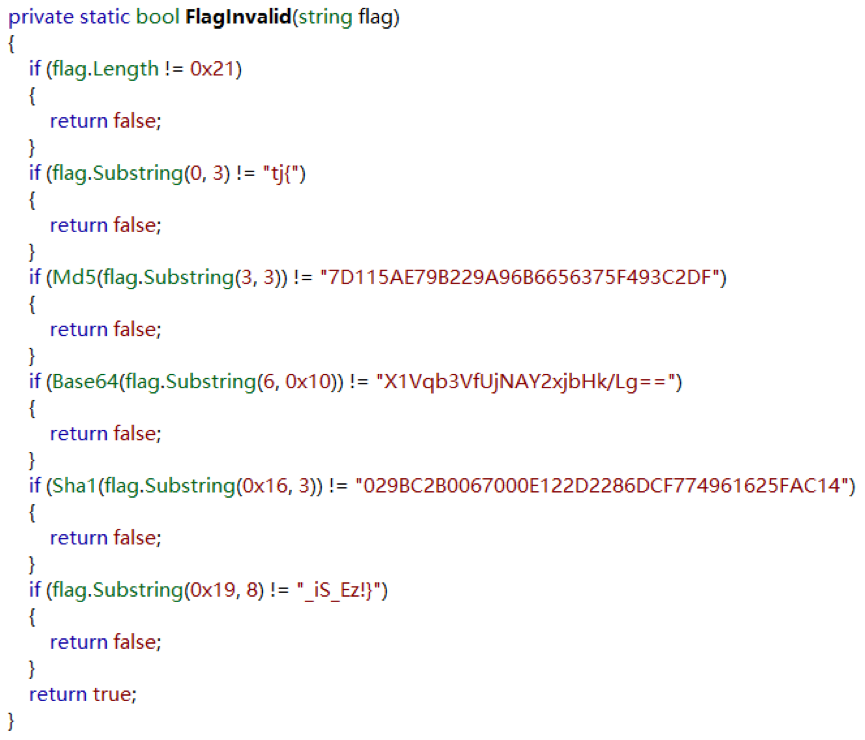

MD5:7D115AE79B229A96B6656375F493C2DF -> `4re`

Base64:X1Vqb3VfUjNAY2xjbHk/Lg== -> `_Ujou_R3@clcly?.`

Sha1:029BC2B0067000E122D2286DCF774961625FAC14 -> `NET`

最终得到Flag：`tj{4re_Ujou_R3@clcly?.NET_iS_Ez!}`

在`cmd`运行一下看看：

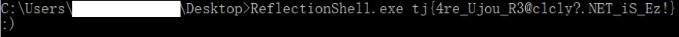

## 0x10 pwn
### 0x11 这也叫缓冲区溢出？(100)

看到**莫里斯**，想到了`gets()缓冲区溢出漏洞`。先用`ida`反编译一下，并打开`main`函数：

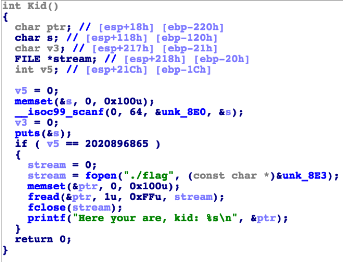

这个`__isoc99_scanf()`函数应该就是`gets()`函数。于是想到利用对`s`的输入，通过缓冲区溢出，根据if条件对`v5`进行覆盖，从而满足if判断条件，使程序执行if分支内的语句，取出并打印藏在`./flag`的结果。

从程序结构来看，条件是`78 74 70 61H`，是ascii码，换算过来是`aptx`；而栈中`v5`到`s`的距离是`0x120 - 0x1c = 260D`，因此输入`260 * 'a' + "aptx"`，得到答案:`tj{we1C0ME_2_The_re4L_wORld_MYKID}`

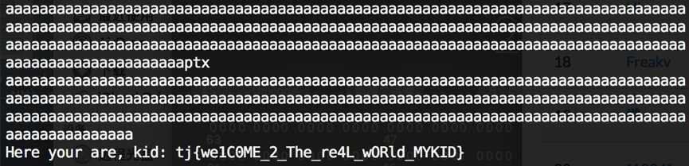

### 0x12 这还是缓冲区溢出？(200)

这道题不是考缓冲区溢出，突破口其实是`printf()格式化输出漏洞`。

本来想用`%11$s`出结果，奈何就是出不了答案，只能试探着4个byte4个byte找结果：`%11$x--%21$x`，在`Hex Friend`帮忙下转换：

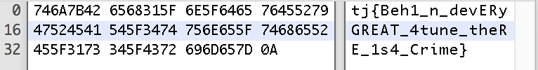

最终得到key:`tj{Beh1_n_devERyGREAT_4tune_theRE_1s4_Crime}`

## 0x20 crypto
### 0x21 RSA(100)

这道题各位大佬肯定有独门算法，不过在这里我给另一个思路：用`WolframAlpha`巧解：

打开`wolframalpha.com`，在搜索框输入：

```
prime factor of 21949311347305581797160582529498169526027487167294416984481778350712846563483858308761365244743101
```

你会惊喜地发现，因为没交钱，所以不会给你解完：

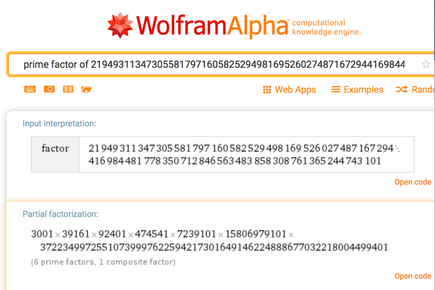

不过我向来是个抠门的人，怎么肯轻易把钱给你。于是我合法地点击了右下角的`Open code`，并输入：

```
FactorInteger[21949311347305581797160582529498169526027487167294416984481778350712846563483858308761365244743101, 9]
```

就合法且免费地得到了flag：`tj{5527278404454199535821801}`。

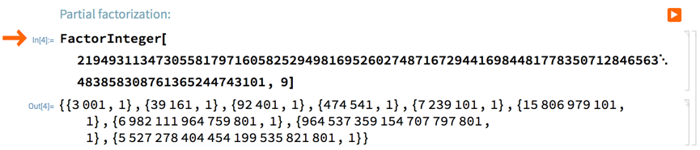

### 0x22 WANNACRY(200)

这道题是做完`.NETTEN.`那道题以后突发的灵感：`XOR加密`。

XOR加密的密钥可以是一个字节，同样可以是很多字节。

这道题突破口有两点：

1. 题目暗示解密以后该文件是wmv文件。而WMV文件的文件头是`30 26 B2 75 8E 66 CF 11 A6 D9 00 AA 00 62 CE 6C`，将WMV标准文件头和被加密的文件头16个byte放到一起进行`XOR`，即得到密钥：`0E A0 E0 47 F0 2B D5 1F 21 C1 65 41 29 2A 93 A0`

2. 可以观察到，这个文件的二进制字符中包含很多`0E A0 E0 47 F0 2B D5 1F 21 C1 65 41 29 2A 93 A0`的循环，立即联想到`XOR`会让它归零，因此是可能性最大的加密方式。

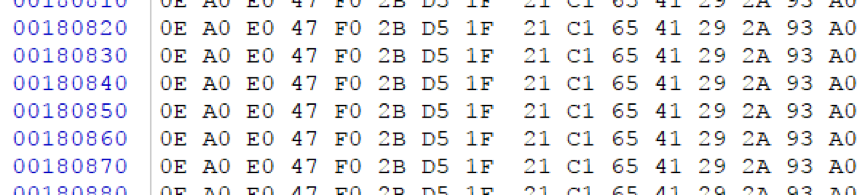

之后使用`XOR Assistant`，方便快捷地解密，得到key：`tj{Aw3s0m3_W1nd0w5_m3d1a}`。

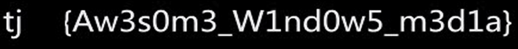

## 0x30 misc
### 0x31 这也是一道签到题(100)

这显然是`Base64`加密，上网找个解密工具：

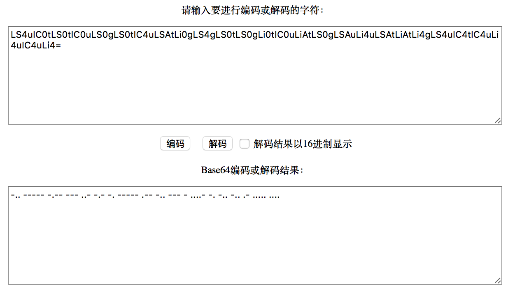

好吧，还要对这串`Morse Code`解密：

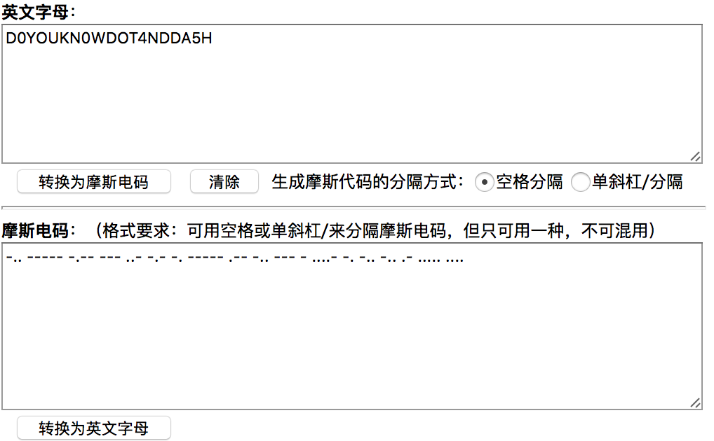

终于得到flag：`tj{D0YOUKN0WDOT4NDDA5H}`。

### 0x33 大新闻(200)

这是`Wireshark`截下来的`.cap`文件。解Wi-Fi密码，应该用`Aircrack-ng`。

打开终端，输入：`sudo aircrack-ng -w dict.txt wifi.cap`：

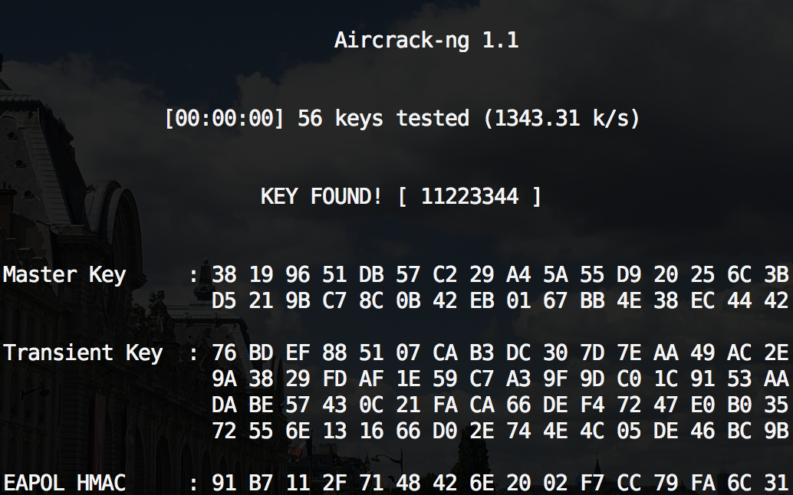

得到flag：`tj{11223344}`。

### 0x34 有毒吧(200)

这次的pcap是`Wireshark`截下来的USB串口通信记录。根据提示，是键盘信息。于是利用`Wireshark`的一个命令行工具`tshark`将通信记录转化成便于读取的形式。

打开终端，输入：`tshark -r xxxxxxxx.pcap -T fields -e usb.capdata > usbdata.txt`。

之后再使用python做一下转换：

```
map_kbd = { 0x04:"a",  0x05:"b",  0x06:"c", 0x07:"d", 0x08:"e", 0x09:"f", 0x0A:"g",  0x0B:"h", 0x0C:"i",  0x0D:"j", 0x0E:"k", 0x0F:"l", 0x10:"m", 0x11:"n",0x12:"o",  0x13:"p", 0x14:"q", 0x15:"r", 0x16:"s", 0x17:"t", 0x18:"u",0x19:"v", 0x1A:"w", 0x1B:"x", 0x1C:"y", 0x1D:"z", 0x1E:"1", 0x1F:"2", 0x20:"3", 0x21:"4", 0x22:"5",  0x23:"6", 0x24:"7", 0x25:"8", 0x26:"9", 0x27:"0", 0x28:"\n", 0x2a:"[DEL]",  0X2B:"    ", 0x2C:" ",  0x2D:"-", 0x2E:"=", 0x2F:"[",  0x30:"]",  0x31:"\\", 0x32:"`", 0x33:";",  0x34:"\'", 0x36:",",  0x37:".",  0x38:"/"}
map_shift = {"a" : "A", "b" : "B", "c" : "C", "d" : "D", "e" : "E", "f" : "F", "g" : "G", "h" : "H", "i" : "I", "j" : "J", "k" : "K", "l" : "L", "m" : "M", "n" : "N", "o" : "O", "p" : "P", "q" : "Q", "r" : "R", "s" : "S", "t" : "T", "u" : "U", "v" : "V", "w" : "W", "x" : "X", "y" : "Y", "z" : "Z", "1" : "!", "2" : "@", "3" : "#", "4" : "$", "5" : "%", "6" : "^", "7" : "&", "8" : "*", "9" : "(", "0" : ")", "-" : "_", "=" : "+", "[" : "{", "]" : "}", "\\" : "|", "`" : "~", ";" : ":", "\'" : "\"", "," : "<", "." : ">", "/" : "?"}
nums = []
keys = open('usbdata.txt')
for line in keys:
    if line[0]!='0' or line[1]=='8' or line[3]!='0' or line[4]!='0' or line[9]!='0' or line[10]!='0' or line[12]!='0' or line[13]!='0' or line[15]!='0' or line[16]!='0' or line[18]!='0' or line[19]!='0' or line[21]!='0' or line[22]!='0':
         continue
    nums.append(int(line[0:2], 16))
    nums.append(int(line[6:8], 16))
keys.close()
output = ""
haveShift = False
for n in nums:
    if n == 0 :
        haveShift = False
        continue
    if n == 0x02 :
        haveShift = True
        continue
    if n in map_kbd:
        if haveShift:
            output += map_shift[map_kbd[n]]
            haveShift = False
        else:
            output += map_kbd[n]
    else:
        output += '[unknown]'
print 'output :\n' + output
```

最终得到key：`tj{L0g1t3ch_Us8_L1sten3r}`。

### 0x35 月黑风高夜(200)

看到图片中大面积的黑色，就知道在里面藏东西了。用Stegsolve看一下：

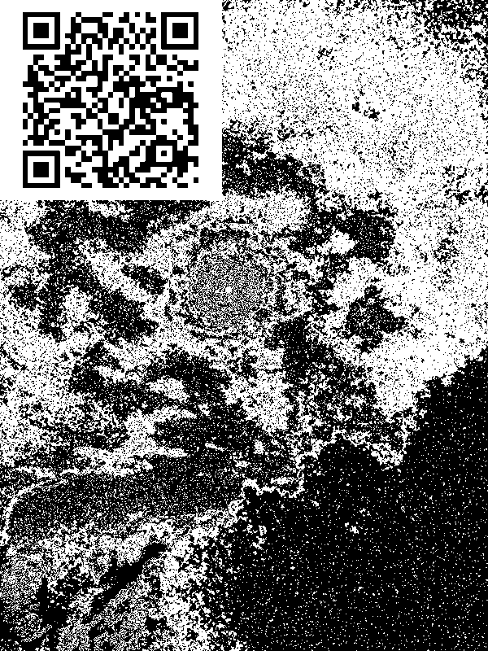

二维码扫一扫，得到flag：`tj{zhaocaijinbao_woaiyingcao}`。

## 0x40 web
很不幸，由于对web知识以及数据库知识的匮乏，本类赛题全军覆没。

## 0x50 basic
略去不表。
